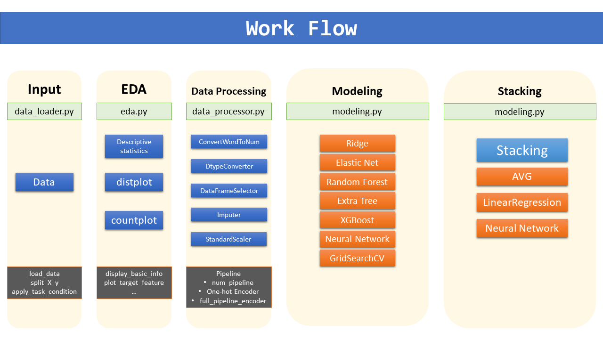

# 1985 Auto Imports Database
Prediction Model of Loss Payment Ratio of Motors, using 1985 Auto Imports Database

## Overview

### Data Set Information:

>This data set consists of three types of entities: (a) the specification of an auto in terms of various characteristics, (b) its assigned insurance risk rating, (c) its normalized losses in use as compared to other cars. The second rating corresponds to the degree to which the auto is more risky than its price indicates. Cars are initially assigned a risk factor symbol associated with its price. Then, if it is more risky (or less), this symbol is adjusted by moving it up (or down) the scale. Actuarians call this process "symboling". A value of +3 indicates that the auto is risky, -3 that it is probably pretty safe. The third factor is the relative average loss payment per insured vehicle year. This value is normalized for all autos within a particular size classification (two-door small, station wagons, sports/speciality, etc...), and represents the average loss per car per year. Note: Several of the attributes in the database could be used as a "class" attribute.

### Dataset Size:
* Number of Instances: 205
* Number of Attributes: 26 total
    * 15 continuous
    * 1 integer
    * 10 nominal

### Instruction
* Problem name: Automobile
* URL: https://archive.ics.uci.edu/ml/datasets/Automobile
* Target variable: normalized-losses
* Problem type: regression
* Data format: csv (missing header)
* Missing values: denoted by quotation marks (‘?’). Skip data samples with missing values in the
target.
* Features to ignore: ‘symboling’

## Workflow


## Documentation
See `./documents/1985_auto_imports_database.pdf` for documentation.

## Dependencies
* Python: 3.5.3
* TensorFlow: 1.2.1
* Keras: 2.0.6
* Scikit-Learn: 0.18.2
* Numpy: 1.13.1
* Pandas: 0.20.2
* XGBoost: 0.6

## Performance

### Single Model
#### Case1
|Random State|Model|MSE|RMSE|
|---|---|---|---|
|12|Ridge|313.0767|17.6940|
|12|Elastic Net|357.9729|18.9202|
|12|Random Forest|875.4044|29.5872|
|12|Extra Tree|740.1835|27.2063|
|12|XGBoost|817.1096|28.5851|
|12|Neural Network|223.5412|14.9513|

#### Case2
|Random State|Model|MSE|RMSE|
|---|---|---|---|
|18|Ridge|415.5719|20.3856|
|18|Elastic Net|426.7968|20.6591|
|18|Random Forest|844.6947|29.0636|
|18|Extra Tree|685.9701|26.1910|
|18|XGBoost|1001.2611|31.6427|
|18|Neural Network|495.6706|22.2637|

#### Case3
|Random State|Model|MSE|RMSE|
|---|---|---|---|
|72|Ridge|263.9897|16.2478|
|72|Elastic Net|270.0922|16.4345|
|72|Random Forest|631.3527|25.1267|
|72|Extra Tree|667.5146|25.8363|
|72|XGBoost|649.5410|25.4861|
|72|Neural Network|446.9455|21.1411|

#### Case4
|Random State|Model|MSE|RMSE|
|---|---|---|---|
|86|Ridge|383.7710|19.5901|
|86|Elastic Net|344.4253|18.5587|
|86|Random Forest|852.8695|29.2039|
|86|Extra Tree|877.0165|29.6145|
|86|XGBoost|512.2365|22.6326|
|86|Neural Network|524.5276|22.9026|

#### Case5
|Random State|Model|MSE|RMSE|
|---|---|---|---|
|109|Ridge|290.9115|17.0561|
|109|Elastic Net|241.7871|15.5495|
|109|Random Forest|534.7114|23.1238|
|109|Extra Tree|533.6554|23.1010|
|109|XGBoost|396.3412|19.9083|
|109|Neural Network|445.1902|21.0995|

### Stacking

#### Case1
|Random State|Blender|MSE|RMSE|
|---|---|---|---|
|12|Average|553.5240|23.5271|
|12|Linear Regression|386.4739|19.6589|
|12|Neural Network|391.7991|19.7939|

#### Case2
|Random State|Model|MSE|RMSE|
|---|---|---|---|
|18|Average|622.8775|24.9575|
|18|Linear Regression|562.9997|23.7276|
|18|Neural Network|544.7601|23.3401|

#### Case3
|Random State|Model|MSE|RMSE|
|---|---|---|---|
|72|Average|297.4342|17.2463|
|72|Linear Regression|309.2991|17.5869|
|72|Neural Network|330.5245|18.1803|

#### Case4
|Random State|Model|MSE|RMSE|
|---|---|---|---|
|86|Average|451.7685|21.2548|
|86|Linear Regression|428.1003|20.6906|
|86|Neural Network|419.6526|20.4854|

#### Case5
|Random State|Model|MSE|RMSE|
|---|---|---|---|
|109|Average|231.3396|15.2099|
|109|Linear Regression|215.0494|14.6646|
|109|Neural Network|317.1345|17.8083|

## Demo
You can simply execute demo file by:
```bash
$ python main.py
```
